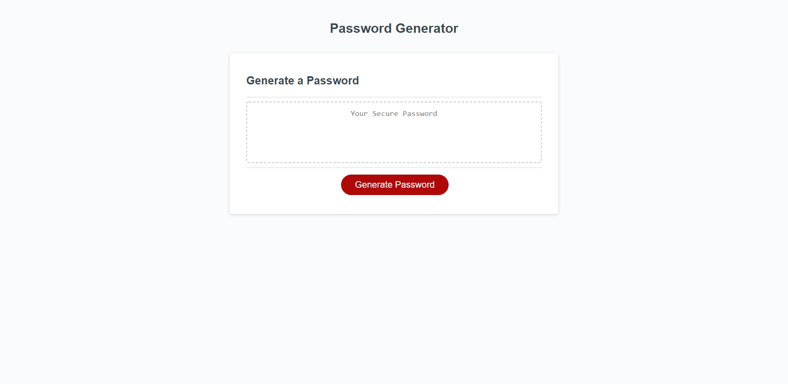

# Password-Generator

Made this project as homework for coding bootcamp.
Application uses Javascript to generate a secure password after asking the user a series of prompts confirming what characters should be included in the password.

## Getting Started

This project has been deployed to GitHub Pages. To get this project up and running, you can follow the deployment link. Or, download the sources files to use this as a template.

* [GitHub Repository](https://github.com/asidiki/thirdchallenge)
* [Deployed GitHub IO](https://asidiki.github.io/thirdchallenge/)

## ScreenShot

